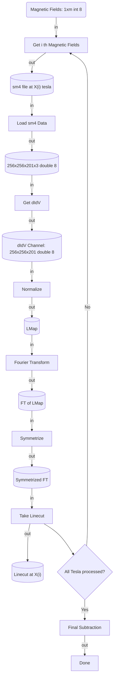

# Mermaid DSL Subset Specification for Executable TaskGraphs

This document defines the allowed subset of Mermaid.js syntax that our system supports for building executable TaskGraphs. Users must adhere to this structure to ensure correct parsing and JSON transformation.

---

## 1. Overview

* **Format:** Mermaid `flowchart TD`
* **Purpose:** Allow users to express dataflow and controlflow logic using natural diagrammatic syntax
* **Constraint:** Only a limited, explicitly defined subset is accepted

---

## 2. Node Types

### 2.1 Parameter Nodes (Inputs)

```
Param_x("<Parameter Description>")
```

* Example:

```
Param_1("Drift Parameters: 1x4 int 8")
```

* Usage: Defined at the beginning; represent external inputs

### 2.2 Operation Nodes (Tools/Functions)

```
OP_x["<Operation Description>"]
```

* Example:

```
OP_3f["Find Drift Field"]
```

* Usage: Represent actual computation steps or tools to be executed

### 2.3 Intermediate Result Nodes

```
MR_x[("<Data Description>")]
```

* Example:

```
MR_4L[("LMap: 256x256x201 double 8")]
```

* Usage: Store intermediate outputs from OP\_x operations

### 2.4 Decision Nodes (If Statements)

```
OP_if{"<Condition?>"}
```

* Example:

```
OP_12{"Is all Tesla field Data processed?"}
```

* Usage: Represent control flow branching decisions

### 2.5 End Result Node (Output)

```
Result["<Final Output Description>"]
```

* Example:

```
Result["Analysis Completed"]
```

---

## 3. Edge Types (Connections)

### 3.1 Data Input Edges

```
<From> -- in_x --> <To>
```

* Example:

```
MR_3t -- in_1 --> OP_3f
```

* Semantics: "Feed this variable as input to a function"

### 3.2 Data Output Edges

```
<From> -- out_x --> <To>
```

* Example:

```
OP_3f -- out_3 --> MR_4DX
```

* Semantics: "This function outputs this variable"

### 3.3 Logical Transitions (Control Flow)

```
<From> --> <To>
```

* Used when there's no clear data dependency, but control should flow
* Example:

```
OP_8 --> OP_13
```

### 3.4 Conditional Transitions (From If/Branch Nodes)

```
<From> -- Yes --> <To>
<From> -- No --> <To>
```

* Example:

```
OP_12 -- Yes --> OP_10
OP_12 -- No --> OP_11
```

---

## 4. Loop Structures (Optional)

> Mermaid.js does not support loops natively. We allow pseudocode-style DSL expressions for `for` and `while` loops to be parsed into loop nodes.

### 4.1 FOR Loop Node

```
OP_loop_2["FOR i in 0..N"]
```

* Must include start and end (e.g., `0..9`)
* Corresponding control edge must reconnect to beginning

### 4.2 WHILE Loop Node

```
OP_while_3["WHILE condition"]
```

* Accepts any textual condition string (parsed later)

### 4.3 BREAK / CONTINUE

```
OP_break_1["BREAK"]
OP_continue_5["CONTINUE"]
```

---

## 5. Syntax Validation Rules

* `OP_`, `MR_`, `Param_` prefixes are **mandatory**
* Each OP node must have **at least one input and one output**, unless it is a control node
* Each edge direction (`-- in -->`, `-- out -->`) must match semantic rules (data must flow into OPs, out from OPs)
* `-- Yes -->`, `-- No -->` are **only valid** from `OP_if` nodes

---

## 6. Example (Valid DSL)



---

## 7. Notes

* For loop support is currently simulated through node labels and graph rewiring (e.g., backward edges)
* JSON translation will enforce stricter validation beyond Mermaid's renderer
* Users should avoid freeform labels unless wrapped in OP\_x, MR\_x, etc.

---

## 8. Future Extensions (Planned)

* Formal DSL validator
* Drag-to-code editor (bidirectional mapping)
* Enhanced visual theming for OP/MR/Param distinctions
